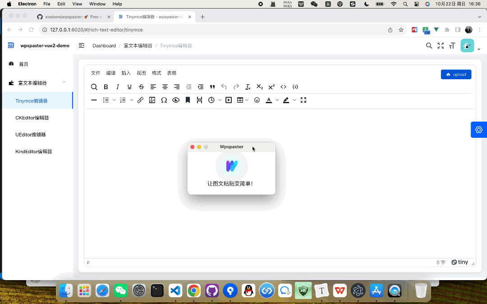

<div align="center">
  
</div>

#### 简介

图文一键粘贴软件，支持从Word、WPS图文复制后一键粘贴到Tinymce、CKEditor、UEditor等富文本编辑器。支持Chrome、360、Edge、Firefox等现代浏览器。适用Window、Mac

- [在线体验](http://xoobom.com:8020/#/rich-text-editor/tinymce) 
- [软件下载](https://github.com/xoobom/wpspaster/releases)
- [gitee](https://gitee.com/xoobom/wpspaster)
- [github](https://github.com/xoobom/wpspaster)
- [官网](http://xoobom.com/wpspaster/)

<div>
  
</div>

#### 核心逻辑

1、启动Wpspaster软件，图文粘贴时获取本地file:///C:/Users/Gientech/AppData/Local/Temp/ksohtml32008/wps7.png图片转base64返回给浏览器

2、浏览器中富文本编辑器拿到base64转file上传图片到服务器上，服务器返回图片url

3、图片url替换


#### 使用说明

免费版：本地启http://127.0.0.1:8020 项目调试

企业、政府标准版：最下方联系我们


#### 常见问题

##### 1、mac安装后打开提示已损坏？

<div>
  
</div>

解决：

系统的“隐私与安全性”中允许“任何来源”

终端输入命令：

```
sudo xattr -d com.apple.quarantine /Applications/wpspaster.app
```

参考[https://blog.csdn.net/wu347771769/article/details/115292816](https://blog.csdn.net/wu347771769/article/details/115292816)


#### 联系我们

wpspaster用户交流QQ群：278919640

QQ：3194249968

<div>
  
  
</div>
