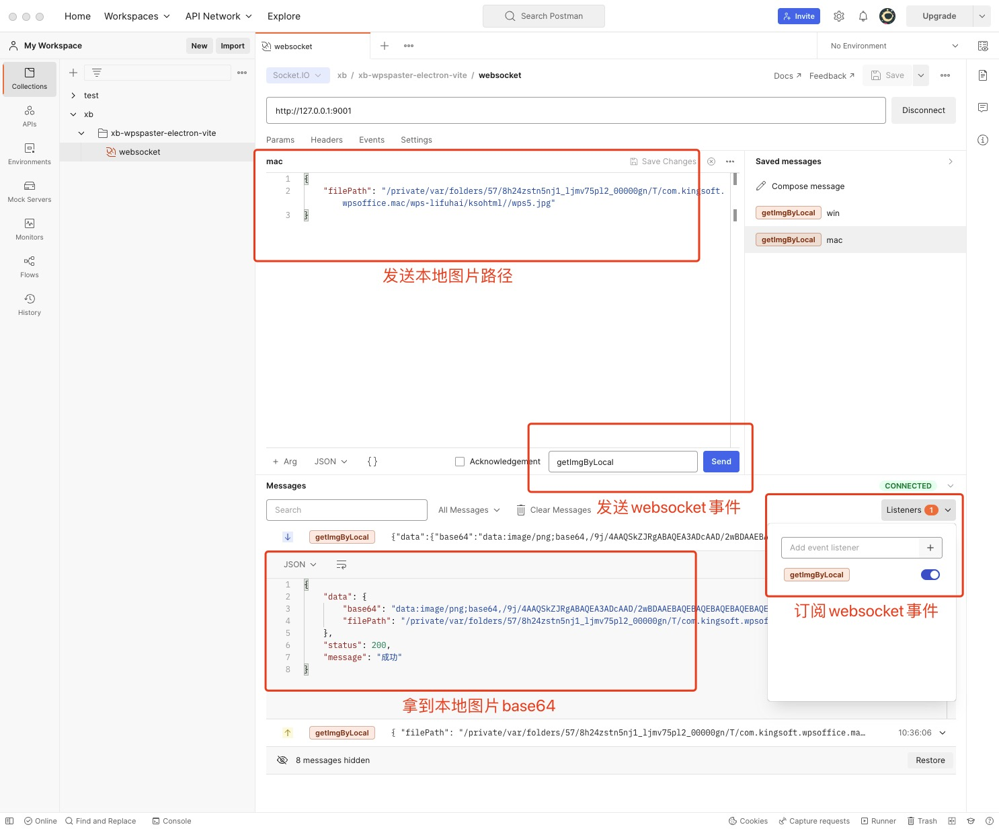

<div align="center">
  
</div>

[简体中文](/README.zh-cn.md) | English

One-click pasting software for picture and text, supports copying picture and text from Word and WPS and then pasting them into rich text editors such as Tinymce, CKEditor, UEditor, KindEditor, etc. with one click. Supports modern browsers such as Chrome, 360, Edge, Firefox, etc. Applicable to Windows and Mac

- [Online Demo](http://xoobom.com:8020/#/rich-text-editor/tinymce) 
- [Download](https://github.com/xoobom/wpspaster/releases)
- [gitee](https://gitee.com/xoobom/wpspaster)
- [github](https://github.com/xoobom/wpspaster)

<div>
  <video  src="./img/mac图文粘贴演示.mp4">
</div>

# Core Logic

1、Start the Wpspaster software, and when pasting images and texts, obtain the local file:///C:/Users/Gientech/AppData/Local/Temp/ksohtml32008/wps7.png image and convert it to base64 and return it to the browser

2、The rich text editor in the browser gets the base64 to file and uploads the image to the server, and the server returns the image URL.

3、Image url replacement


# Catalog description

```
├── example                    # example
│   │── wpspaster-backend      # Image upload interface, can be replaced with Java
│   │── wpspaster-jquery-demo  # jQuery project demo
│   └── wpspaster-vue2-demo    # Vue project demo
├── ueditor              # Ueditor code, changes: picture src: attrs.src
```


# Instructions for use

## Wpspaster run

win：wpspaster-v2.0.0.exe

mac：wpspaster-v2.0.0.dmg


## Image upload interface run

Start the wpspaster-backend project locally


## Vue2 project run

Start the wpspaster-vue2-demo project locally


## jQuery project run

Install the plug-in Live Server in vscode, right-click the index.html page Open with Live Server to start, port 5500

<div align="center">
  
</div>


## Postman self-test

<div align="center">
  
</div>


# Common problem

## After opening on mac, it says it is damaged?

<div>
  
</div>

solve:

Allow "Any Source" in the system's "Privacy & Security"

Enter the command in the terminal:

```
sudo xattr -d com.apple.quarantine /Applications/Wpspaster.app
```

refer to[https://blog.csdn.net/wu347771769/article/details/115292816](https://blog.csdn.net/wu347771769/article/details/115292816)

## Is wpspaster compatible with certain rich text editor limitations?

answer：wpspaster and the rich text editor are independent and theoretically support all rich text editors. wpspaster is just for getting local images.


# Discussion

## QQ group

Group number：278919640      

<div>
  
</div>

## Author QQ

QQ number：3194249968

<div>
  
</div>

# Contribution
Wpspaster is open to the outside world, whether it is just modifying the punctuation marks of the document or major reconstruction of the overall function of wpspaster, we welcome it. We will carefully review, respond to, and merge every PR you submit.
<div>
<a href="https://github.com/vuejs/vue/graphs/contributors"></a>
</div>


# Donate

If you think this project has helped you, you can donate a cup of coffee to express your encouragement. :moneybag: :coffee:
<div>
  
  
</div>

# License

[MIT](https://opensource.org/licenses/MIT)

Copyright (c) 2022-present, Li Fuhai