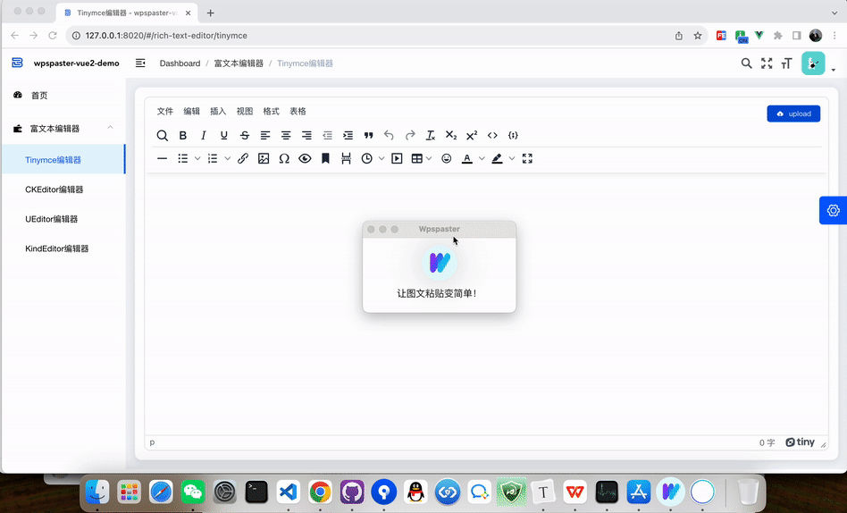
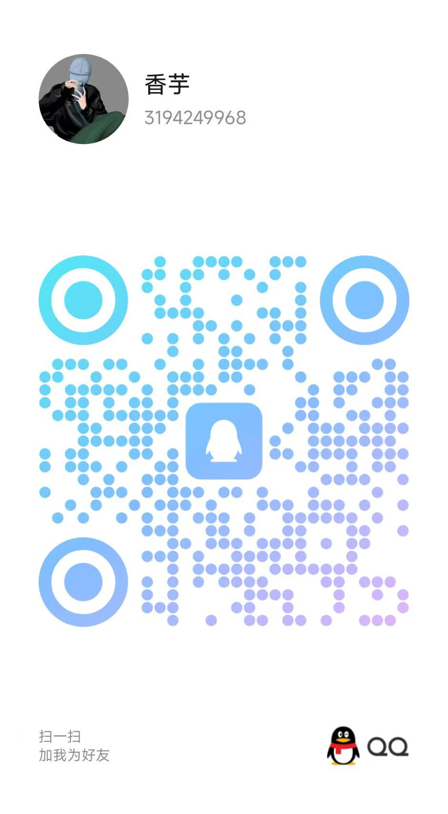

<div align="center">
  
</div>

简体中文 | [English](/README-en.md)

图文一键粘贴软件，支持从Word、WPS图文复制后一键粘贴到Tinymce、CKEditor、UEditor、KindEditor等富文本编辑器。支持Chrome、360、Edge、Firefox等现代浏览器。适用Window、Mac

- [在线体验](http://xoobom.com:8020/#/rich-text-editor/tinymce) 
- [软件下载](https://github.com/xoobom/wpspaster/releases)
- [gitee](https://gitee.com/xoobom/wpspaster)
- [github](https://github.com/xoobom/wpspaster)

<div>
  
</div>

# 核心逻辑

1、启动Wpspaster软件，图文粘贴时获取本地file:///C:/Users/Gientech/AppData/Local/Temp/ksohtml32008/wps7.png图片转base64返回给浏览器

2、浏览器中富文本编辑器拿到base64转file上传图片到服务器上，服务器返回图片url

3、图片url替换


# 目录说明

```
├── example                    # 例子
│   │── wpspaster-backend      # 图片上传接口，可按需替换成java接口
│   │── wpspaster-jquery-demo  # jquery项目demo
│   └── wpspaster-vue2-demo    # vue项目demo
├── ueditor                    # 百度编辑器源码，改动点：图片src: attrs.src
├── wpspaster-electron-vite    # wpspaster源码
```


# 使用说明

## 视频演示

【wpspaster工程运行演示-哔哩哔哩】 https://b23.tv/0eJoIxh


## Wpspaster启动

安装启动：releases里的安装包安装后启动

本地启动：本地启wpspaster-electron-vite工程


## 图片上传接口启动

本地启wpspaster-backend工程


## Vue2项目启动

本地启wpspaster-vue2-demo工程


## jQuery项目启动

vscode装插件Live Server，右键index.html页面Open with Live Server启动，端口5500

<div align="center">
  
</div>


## Postman自测

<div align="center">
  
</div>


# 常见问题

## mac安装后打开提示已损坏？

<div>
  
</div>

解决：

系统的“隐私与安全性”中允许“任何来源”

终端输入命令：

```
sudo xattr -d com.apple.quarantine /Applications/Wpspaster.app
```

或者

```
xattr -cr /Applications/Wpspaster.app
```


## 其他问题

https://h1o5fjihr4.feishu.cn/wiki/WQjfwaubgi3N50kjO6ecpCtOn1g?from=from_copylink


# 沟通交流

## QQ群

群号：278919640      

<div>
  
</div>

## 作者QQ

QQ号：3194249968

<div>
  
</div>


# 贡献代码

wpspaster对外持开放态度，不论是只修改文档的标点符号还是对wpspaster的整体功能有大的重构我们都欢迎。对于您的每一个PR我们都会认真查看、回复、合并。
<div>
<a href="https://github.com/vuejs/vue/graphs/contributors"></a>
</div>


# 捐赠

如果你觉得这个项目帮助到了您，您可以捐赠一杯咖啡:moneybag:表示鼓励 :coffee:
<div>
  
  
</div>

# 许可证

[MIT](https://opensource.org/licenses/MIT)

Copyright (c) 2022-present, Li Fuhai